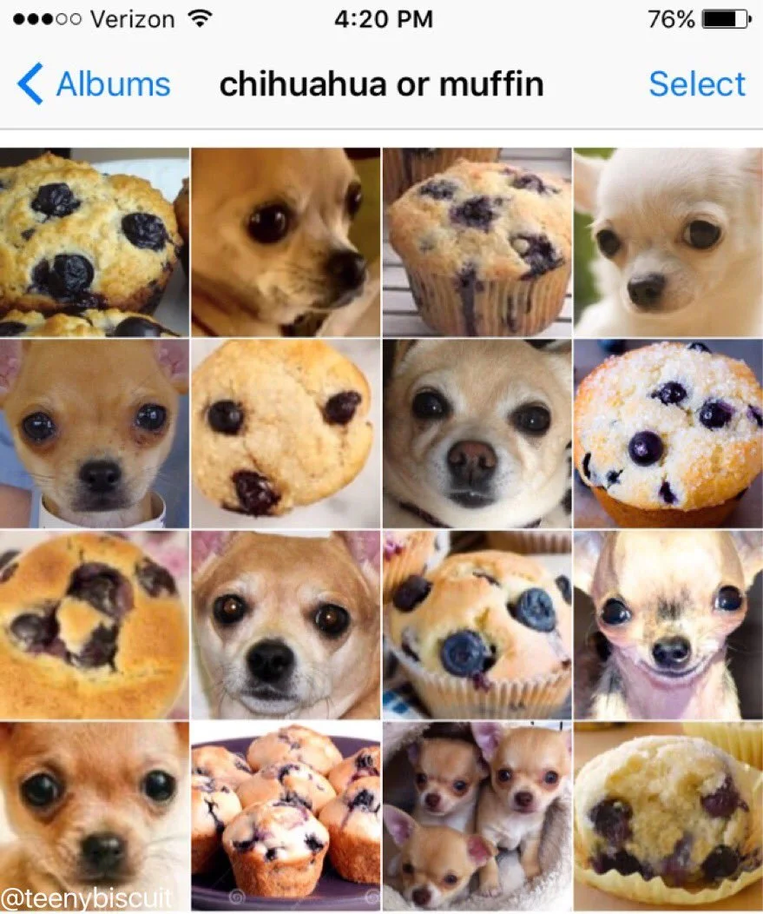
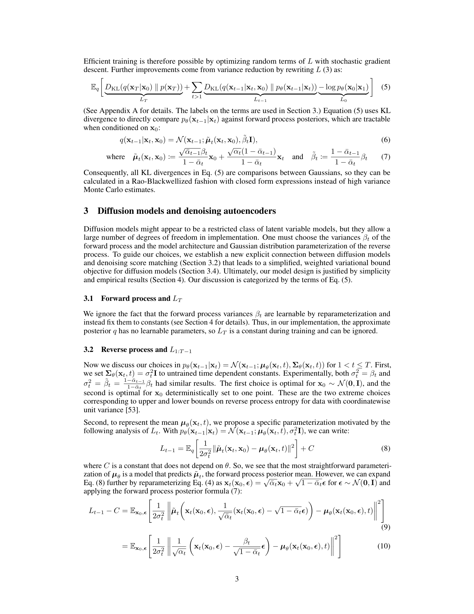
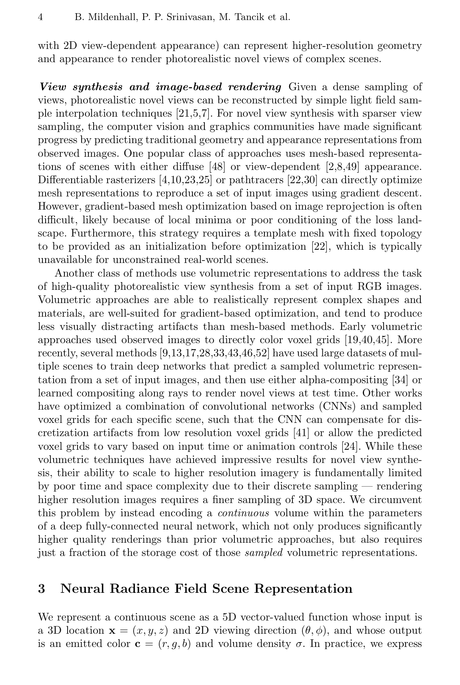
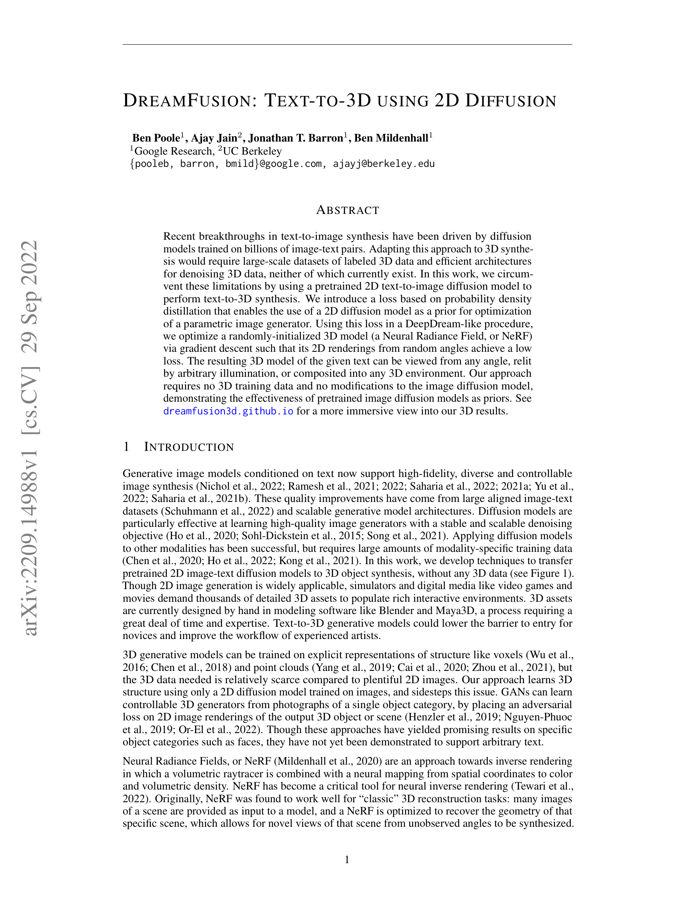
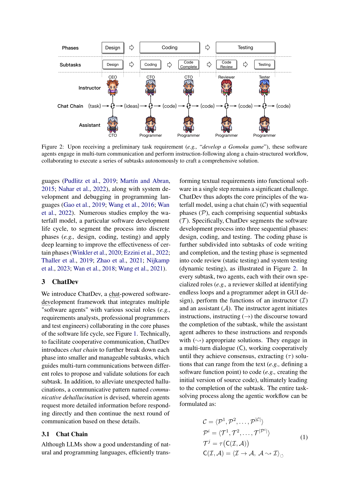

# The New Advent of AI: From Mathematical Theory to Creative Tools

## A Comprehensive Introduction for Media Professionals

This document explains the foundations of modern artificial intelligence for readers who understand computers and digital media production but may not have a background in machine learning. It traces the path from theoretical mathematics to the AI tools transforming creative industries today.

**Important Note:** Throughout this document, remember that "AI" is a marketing term. What we call artificial intelligence is fundamentally **trained mathematical algorithms**—sophisticated pattern-matching systems that have no understanding, consciousness, or intelligence in the human sense. Every system described here consists of mathematical operations (primarily multiplying tables of numbers together) executed on computer hardware. The "magic" is in the scale and training, not in any form of genuine cognition.

**A note on mathematics:** This document will occasionally mention matrices (tables of numbers), vectors (lists of numbers), and multiplying them together. You do not need to understand linear algebra to follow the concepts—just know that these are ways of organizing and combining numbers. When I say "768-dimensional," think "a list of 768 numbers." When I say "matrix multiplication," think "combining two tables of numbers using a specific formula."

**Reading Guide:** Each section ends with "How This Leads To..." connecting it to what comes next. If a section feels too technical, skip to its connection summary and continue.

---

## Part 1: What AI Actually Means (And What It Doesn't)

### 1.1 The Term "Artificial Intelligence"

The term "artificial intelligence" was coined in 1956 at a workshop at Dartmouth College, organized by John McCarthy, Marvin Minsky, Nathaniel Rochester, and Claude Shannon. Their proposal stated the ambitious goal:

> "We propose that a 2 month, 10 man study of artificial intelligence be carried out... The study is to proceed on the basis of the conjecture that every aspect of learning or any other feature of intelligence can in principle be so precisely described that a machine can be made to simulate it." (McCarthy, Minsky, Rochester, & Shannon, 1955, p. 1)

This vision remains largely unrealized seventy years later. What we call "AI" today is more accurately described as **machine learning**—systems that find patterns in data and make predictions based on those patterns. These systems do not "understand" anything in the human sense. They are sophisticated pattern-matching engines executing mathematical operations.

> **Key Insight:** When someone says "AI generated this image," they really mean "a mathematical algorithm trained on millions of images found statistical regularities in visual data and produced output that follows those learned patterns."

### 1.2 The Two Eras of AI

**Classical AI (1956–2010): Rule-Based Systems**

The first era of AI relied on human experts writing explicit rules—a paradigm called **symbolic AI** or **expert systems**. Researchers believed that encoding human knowledge as logical rules would produce intelligent behavior.

Examples of classical AI systems:

- **MYCIN** (1976): A medical diagnosis system at Stanford containing ~600 hand-written rules like "IF the patient has fever AND the culture shows gram-positive cocci THEN consider staphylococcus infection" (Shortliffe, 1976)
- **Deep Blue** (1997): IBM's chess computer that defeated world champion Garry Kasparov using hand-crafted evaluation functions and brute-force search through millions of positions
- **Expert systems** in business: Rule-based systems for loan approval, insurance claims, and manufacturing quality control

Video game AI from this era used the same approach:

```text
IF player_health < 20 THEN flee
IF enemy_visible AND weapon_equipped THEN attack
IF distance_to_player > 100 THEN patrol
```

**Why classical AI reached its limits:**

These systems worked for narrow, well-defined domains but failed at anything requiring nuance or real-world perception. Deep Blue could evaluate chess positions but could not recognize a chess piece in a photograph. MYCIN could diagnose bacterial infections but could not understand a patient saying "I feel terrible." The approach required human experts to manually encode every rule—an impossible task for complex domains like vision or natural language.

**The AI Winters:** Twice—in the mid-1970s and late 1980s—funding and interest in AI collapsed when the technology failed to deliver on its promises. These "AI winters" lasted years and left the field in relative obscurity (Crevier, 1993).

**What Changed Between 2010 and 2012:**

The transition from classical to modern AI was not instantaneous. Several developments converged:

1. **GPU computing** (2007–2012): NVIDIA released CUDA in 2007, allowing researchers to use graphics cards for general computation. By 2012, GPUs could train neural networks 10–50× faster than CPUs.

2. **Large datasets** (2009–2012): ImageNet, a database of 14 million labeled images organized into 20,000 categories, was released in 2009 (Deng et al., 2009). This provided the training data neural networks needed.

3. **Algorithmic improvements** (2006–2012): Hinton et al. (2006) demonstrated that deep neural networks could be trained effectively using unsupervised pre-training, reigniting interest in neural approaches.

**Modern AI (2012–present): Learning From Data**

The breakthrough was letting machines discover their own patterns by analyzing massive datasets. Instead of programming "what a cat looks like," you show the system millions of cat photos and let it figure out the statistical regularities.

This shift—from human-written rules to learned patterns—is the foundation of everything that followed.

### How This Leads To...

If machines can learn patterns from data, the next question is: *how* do they learn? Part 2 explains the mathematical machinery that makes learning possible.

---

## Part 2: The Mathematical Foundation (Made Simple)

### 2.1 The Big Picture: What Is a Neural Network?

A neural network is a mathematical function that transforms input data into output predictions. It is called "neural" because its structure was loosely inspired by biological neurons in the 1940s, but this is a historical metaphor—modern neural networks have little resemblance to how brains actually work.

**Think of it as a complex formula:**

Imagine you are sorting mail. Each letter needs to go to the right house, but the addresses are smudged. You learn to recognize patterns: "This squiggle usually means house #5, that curve usually means house #12."

A neural network does the same thing, but with numbers. It takes input (like pixel values from an image), processes them through a series of mathematical calculations, and produces output (like "this is a cat").

```text
┌─────────────┐     ┌─────────────┐     ┌─────────────┐
│   INPUT     │     │  PROCESSING │     │   OUTPUT    │
│             │     │             │     │             │
│  Raw data   │ ──► │  Math       │ ──► │  Prediction │
│ (pixels,    │     │  (weights & │     │ (cat, dog,  │
│  numbers)   │     │  additions) │     │  person)    │
└─────────────┘     └─────────────┘     └─────────────┘
```

**Critical point:** There is nothing "intelligent" happening here. The network is executing mathematical operations—primarily additions and multiplications—on numbers. The apparent intelligence emerges from doing this at massive scale on carefully structured data.

### 2.2 Neurons: The Building Blocks (Spreadsheet Analogy)

Forget biology. An artificial "neuron" is simply a formula—exactly like a cell in a spreadsheet that calculates a weighted sum.

**The restaurant rating example:**

Imagine you rate restaurants based on three factors:

1. Food quality (scored 1–10)
2. Service (scored 1–10)
3. Atmosphere (scored 1–10)

But they are not equally important to you. Food matters most (weight: 0.6), service matters somewhat (weight: 0.3), and atmosphere is nice but not essential (weight: 0.1).

Your overall rating calculation:

```text
Overall = (Food × 0.6) + (Service × 0.3) + (Atmosphere × 0.1)
```

For a restaurant with Food=8, Service=7, Atmosphere=5:

```text
Overall = (8 × 0.6) + (7 × 0.3) + (5 × 0.1)
        = 4.8 + 2.1 + 0.5
        = 7.4
```

**That is exactly what a neuron does:**

```text
┌─────────────────────────────────────────────────────────────┐
│  NEURON = Weighted Sum + Decision                           │
│                                                              │
│  Input 1 (8)  ×  Weight 1 (0.6)  =  4.8  ─┐                 │
│  Input 2 (7)  ×  Weight 2 (0.3)  =  2.1  ─┼─► Sum: 7.4 ─┐   │
│  Input 3 (5)  ×  Weight 3 (0.1)  =  0.5  ─┘             │   │
│                                                          ▼   │
│                              Decision Function ──► Output    │
│                           (Should I activate?)               │
└─────────────────────────────────────────────────────────────┘
```

**The decision function (activation function):**

After computing the weighted sum, the neuron applies a threshold to decide whether to "activate" (output a signal) or stay quiet. Using our restaurant example:

```text
Threshold: 5.0

If sum ≥ 5.0 → Output: "Activate" (pass signal forward)
If sum < 5.0 → Output: "Stay quiet" (no signal)

Our example: Sum = 7.4
Since 7.4 ≥ 5.0 → This neuron activates
```

**Connecting the analogy:** In plain terms, if your restaurant rating calculation produces a score of 5 or higher, you might tell a friend about it (activate). Below 5, you would not mention it (stay quiet). The neuron decides whether to "fire" its signal to the next layer based on whether the weighted sum crosses the threshold.

**Why thresholds matter:** Without thresholds, a neural network would just be a complicated way to do addition and multiplication—the output would always be a simple combination of inputs. Thresholds introduce non-linearity: they let the network represent complex patterns like "activate only if BOTH of these inputs are high" or "activate if EITHER input is high but not if both are." This non-linearity is what allows networks to learn complex, interesting patterns.

In practice, modern networks use smoother threshold functions. **ReLU (Rectified Linear Unit)** is the most common: if the weighted sum is negative, output 0; if positive, pass it through unchanged. Think of it as "ignore weak signals, amplify strong ones" (Nair & Hinton, 2010).

### 2.3 Layers: Stacking Neurons (Assembly Line Analogy)

One neuron can make simple decisions. Stack them in layers, and they can recognize complex patterns.

**Think of a car factory assembly line:**

```text
Station 1: Attach wheels      (Simple, local task)
Station 2: Install engine     (Builds on wheels being there)
Station 3: Add body panels    (Builds on engine)
Station 4: Paint              (Builds on body)
Station 5: Final inspection   (Looks at complete car)
```

Each station does one simple job, but the sequence creates a complex product.

**Neural networks for image recognition work similarly:**

```text
Layer 1: Detect edges         (Where does light change to dark?)
Layer 2: Detect shapes        (Are those edges forming circles? Squares?)
Layer 3: Detect parts         (Is that circle an eye? A wheel?)
Layer 4: Detect objects       (Is that a face? A car?)
Layer 5: Classify             (Is this a cat, dog, or person?)
```

**IMPORTANT: This is emergent behavior, not programmed behavior.**

Nobody tells Layer 1 to look for edges or Layer 3 to look for eyes. These patterns emerge automatically during training. The network sees millions of images with labels and gradually adjusts its weights until certain neurons happen to respond strongly to edges, others to shapes, and so on.

Research visualizing what neurons learn has confirmed this emergence. Zeiler & Fergus (2014) showed that early layers consistently develop edge detectors, middle layers develop texture and part detectors, and late layers develop object detectors—all without any human specification of what to look for.

The specific patterns that emerge depend on:

- The training data
- The random initial weights
- The network architecture
- The training duration

Different training runs produce different internal representations. The network finds *a* solution, not *the* solution.

```text
┌───────────┐   ┌───────────┐   ┌───────────┐   ┌───────────┐
│  Layer 1  │   │  Layer 2  │   │  Layer 3  │   │  Layer 4  │
│           │   │           │   │           │   │           │
│   Edges   │──►│  Shapes   │──►│   Parts   │──►│  Objects  │
│   ╱ ╲ │   │   │  ○ □ △    │   │  👁 🦻    │   │  🐱 🐶    │
└───────────┘   └───────────┘   └───────────┘   └───────────┘
     ↑               ↑               ↑               ↑
  EMERGES         EMERGES         EMERGES         EMERGES
  during          during          during          during
  training        training        training        training
```

A network with many layers is called "deep"—hence "deep learning."

### 2.4 Learning: How the Network Gets Smarter

The network does not start knowing anything. All those weights (like 0.6, 0.3, 0.1 from the restaurant example) start as random numbers.

**Learning is the process of adjusting weights to make better predictions.**

This process has two distinct phases:

**Phase 1: TRAINING (happens once, takes hours to months)**

```text
Step 1: GUESS
   Network sees an image, makes a prediction: "I think this is a dog"

Step 2: CHECK
   Compare to the correct answer: "Actually, it's a cat"

Step 3: MEASURE ERROR
   Calculate how wrong the guess was (using a "loss function")

Step 4: ADJUST WEIGHTS
   Use calculus (backpropagation) to figure out which weights caused
   the error and tweak them slightly in the right direction

Step 5: REPEAT
   Do this millions of times with millions of examples
```

Training GPT-3 took several weeks on thousands of GPUs and cost an estimated $4.6 million in compute (Brown et al., 2020).

**Phase 2: INFERENCE (happens every time you use it)**

After training, the weights are fixed. When you use ChatGPT or Stable Diffusion, you are running the trained network forward—input goes in, output comes out. No learning happens during inference. The model cannot improve from your conversations (unless the company explicitly retrains it later).

```text
TRAINING:    Input → Network → Output → Compare to answer → Adjust weights
             (Millions of times, expensive, done by AI companies)

INFERENCE:   Input → Network → Output
             (Every time you use the model, cheap, instant)
```

**Analogy: Learning to shoot baskets**

Training: You throw the ball thousands of times, missing, adjusting, missing, adjusting. After months of practice, you have "learned" the right motion.

Inference: Now you play a game. You don't learn during the game—you apply what you already learned. Each shot uses the same trained skill.

Neural networks work the same way. Training is when learning happens. Inference is when the learned model is applied.

**Backpropagation:** The algorithm that makes training possible was popularized by Rumelhart, Hinton, and Williams (1986). "Backpropagation" is short for "backward propagation of errors"—it calculates, for each weight in the network, how much that weight contributed to the error. Using calculus (specifically, the chain rule for derivatives), the algorithm efficiently computes how to adjust millions of weights to reduce the error.

### 2.5 Why Scale Matters

Small networks can learn small patterns. Bigger networks can learn bigger patterns. But there is a threshold where something surprising happens.

```text
Network Size (parameters)    What It Can Do
─────────────────────────────────────────────────────
      1,000                  Simple patterns
    100,000                  Basic image features
  1,000,000                  Image classification
100,000,000                  Complex language, some reasoning
175,000,000,000 (GPT-3)     Coherent writing, apparent creativity
```

At massive scales, networks exhibit "emergent capabilities"—abilities that appear suddenly rather than improving gradually (Wei et al., 2022). GPT-3 can write poetry, answer questions, and explain concepts not because it was explicitly trained to, but because at sufficient scale, pattern recognition becomes sophisticated enough to appear like understanding.

**Why does scale produce emergence?**

This remains an active research question, but the intuition is: small networks can only memorize simple patterns ("dog" often follows "the"). Larger networks can represent more complex patterns ("the [adjective] dog [verb]ed"). At sufficient scale, the network can represent patterns that span entire paragraphs, connecting distant concepts—patterns so complex they resemble reasoning.

Additionally, larger networks have more "room" for different neurons to specialize. In a small network, one neuron might need to respond to both "cats" and "vehicles." In a massive network, specialized neurons emerge for increasingly specific concepts.

**But remember:** It is still pattern matching. The network has no goals, no understanding, no awareness. It predicts statistically likely outputs given its inputs and training.

### How This Leads To...

We now understand that neural networks learn patterns by adjusting weights. But there is a problem: traditional networks struggled with sequences (like sentences or video frames). Part 3 explains the pre-transformer solutions, and Part 4 reveals the breakthrough that changed everything.

---

## Part 3: The Deep Learning Revolution (2012–2017)

### 3.1 Why GPUs Matter: A Hardware Primer

Before explaining the 2012 breakthrough, we need to understand why hardware matters.

**What is a CPU?**

The CPU (Central Processing Unit) is the "brain" of your computer. It executes instructions one at a time (or a few at a time with multiple cores). CPUs are designed for complex, sequential tasks—running your operating system, managing files, executing programs.

**What is a GPU?**

The GPU (Graphics Processing Unit) was originally designed to render video game graphics. Rendering a 3D scene requires performing the same calculation on millions of pixels simultaneously—determining the color of each pixel based on lighting, textures, and geometry.

To do this efficiently, GPUs have thousands of simple cores that can all work at once:

```text
CPU: 8-16 powerful cores        GPU: 4,000-16,000 simple cores
     Doing different things          All doing the same thing
     Sequential processing           Parallel processing

     🧠 🧠 🧠 🧠                    🔵🔵🔵🔵🔵🔵🔵🔵🔵🔵...
     Complex tasks                  Simple tasks, many at once
```

**Why neural networks need GPUs:**

A neural network is essentially a giant matrix multiplication. When an image passes through a layer, we multiply a matrix of pixel values by a matrix of weights:

```text
[Input pixels] × [Weight matrix] = [Output values]
 (1 million)      (1M × 1M)         (1 million)
```

This requires billions of multiply-add operations. On a CPU, these happen mostly sequentially. On a GPU, thousands happen in parallel.

**The numbers:**

| Hardware | Training Time | Why |
|----------|---------------|-----|
| 2010 CPU | Weeks–months | Sequential processing |
| 2012 GPU | Hours–days | Parallel processing |
| 2024 GPU cluster | Minutes–hours | Thousands of GPUs |

NVIDIA's CUDA platform, released in 2007, allowed researchers to program GPUs for general computation. This made the deep learning revolution possible.

### 3.2 The ImageNet Moment

In 2012, a neural network called **AlexNet** won the ImageNet Large Scale Visual Recognition Challenge (ILSVRC) by a massive margin—reducing error from 26% to 16% (Krizhevsky, Sutskever, & Hinton, 2012).

This was not a gradual improvement. Previous winners improved by 1-2% per year. AlexNet improved by 10%. The competition was over.

**What made AlexNet possible:**

1. **GPUs**: AlexNet was trained on two NVIDIA GTX 580 graphics cards. The same training would have taken weeks on CPUs; it took 5-6 days on GPUs.

2. **Data scale**: ImageNet provided 1.2 million labeled training images—orders of magnitude more than previous datasets.

3. **Depth**: AlexNet had 8 layers, deeper than previous successful networks. More layers meant the network could learn more abstract features.

This moment marked the beginning of deep learning's dominance. Within two years, every major tech company had pivoted to neural network approaches.

### 3.3 Convolutional Neural Networks (CNNs): Eyes for Computers

**What problem CNNs solve:**

Before CNNs, image recognition was a hard problem. Researchers hand-crafted features ("look for this edge pattern, this color histogram") and fed them to classifiers. Results were poor for complex images.

CNNs learn their own features automatically. They became famous for tasks like distinguishing images of chihuahuas from images of muffins—a tongue-in-cheek example that illustrated both their power and their brittleness.



*Figure 1: "Chihuahua or Muffin?" from the Recognition Series. Source: Karen Zack (@teenybiscuit), March 2016. Used to illustrate that neural networks match visual patterns, not concepts.*

The CNN architecture was introduced by LeCun et al. (1998) for handwritten digit recognition, but only became practical at scale after AlexNet.

**The key insight:** Nearby pixels matter more than distant ones.

Instead of connecting every pixel to every neuron (which would require trillions of connections for a large image), CNNs use a small "filter" that slides across the image like a magnifying glass.

**Analogy: The Flashlight Inspector**

Imagine you are inspecting a painting in a dark room with a small flashlight. You can only see a tiny patch at a time. As you move the flashlight around, you ask: "Is there a sharp change from light to dark here?" (edge detection) or "Is there a repeating pattern here?" (texture detection).

```text
┌──────────────────────────────────────────────────────────┐
│  The "flashlight" (filter) slides across the image:      │
│                                                          │
│  Position 1    Position 2    Position 3                  │
│  ┌───┐         ┌───┐         ┌───┐                       │
│  │ █ │ ░ ░     ░ │ █ │ ░     ░ ░ │ █ │                   │
│  │   │ ░ ░     ░ │   │ ░     ░ ░ │   │                   │
│  └───┘         └───┘         └───┘                       │
│                                                          │
│  At each position: "Is there an edge here?"              │
│  Output: A number indicating edge strength               │
└──────────────────────────────────────────────────────────┘
```

The filter learns what patterns to look for during training. Different filters learn to detect different features—edges at various angles, colors, textures. Later layers combine these simple detections into complex recognitions.

### 3.4 Recurrent Neural Networks (RNNs): Memory for Sequences

**What problem RNNs solve:**

CNNs work for images because an image is a fixed grid of pixels. But language and audio are sequences—the order matters, and the length varies.

```text
"The cat sat on the ___"

To predict the blank, you need to remember "cat" from earlier.
```

**RNNs process sequences one step at a time, carrying forward a "memory" of previous steps:**

```text
      ┌─────────────────────────────────────────┐
      │            Memory State                 │
      │      ↓        ↓        ↓        ↓       │
      │   ┌──────┐ ┌──────┐ ┌──────┐ ┌──────┐   │
Input │   │ The  │→│ cat  │→│ sat  │→│ on   │→ ?│
      │   └──────┘ └──────┘ └──────┘ └──────┘   │
      └─────────────────────────────────────────┘
```

The LSTM (Long Short-Term Memory) variant, introduced by Hochreiter and Schmidhuber (1997), added mechanisms for the network to decide what to remember and what to forget.

**The problem with RNNs:**

Memory fades. By the time you reach "on," the network might have forgotten whether the subject was "cat" or "dog." This is called the "vanishing gradient problem"—errors become too small to effectively update early layers.

More fundamentally, RNNs must process one word at a time. You cannot parallelize this—step 4 depends on step 3, which depends on step 2. This made RNNs slow to train and limited their practical size.

### How This Leads To...

RNNs worked but poorly for long sequences. They were also slow (must process one word at a time). The transformer architecture (Part 4) solved both problems—and changed everything.

---

## Part 4: Transformers - The Architecture That Changed Everything

### 4.1 The Breakthrough Paper

"Attention Is All You Need" (Vaswani et al., 2017) introduced the **transformer** architecture. With over 158,000 citations as of 2024, it is arguably the most influential AI paper ever published.

The authors were researchers at Google Brain and Google Research. They were trying to improve machine translation (English to German, etc.) and discovered an architecture that would reshape the entire field.

The key innovation: **self-attention**—a mechanism that lets the model look at all parts of the input simultaneously.

### 4.2 Attention Explained: The Librarian Analogy

**Imagine you are researching a topic in a library.**

You ask: "Where should I look for information about Victorian architecture?"

A bad librarian (like RNNs) reads every book in order, forgetting earlier books by the time they reach later ones.

A good librarian (like transformers) can look at ALL books simultaneously and instantly identify which ones are relevant:

```text
Your question: "Victorian architecture"

Library catalog:
├── "History of Rome"           → Not relevant (ignore)
├── "Gothic Cathedrals"         → Somewhat relevant (some attention)
├── "Victorian Houses of London"→ Very relevant (high attention!)
├── "Modern Skyscrapers"        → Not relevant (ignore)
└── "British Empire 1837-1901"  → Relevant context (medium attention)
```

The librarian does not read linearly—they scan everything at once and focus on what matters.

### 4.3 Self-Attention in Practice

In the sentence "The cat sat on the mat because **it** was tired," what does "it" refer to?

Self-attention computes relevance scores between every word and every other word:

```text
Processing the word "it":

   The    cat    sat    on    the    mat  because   it    was  tired
    │      │      │      │      │      │      │      │      │      │
    ▼      ▼      ▼      ▼      ▼      ▼      ▼      ▼      ▼      ▼
  [0.05] [0.70] [0.10] [0.02] [0.02] [0.08] [0.01] [---] [0.01] [0.01]
           ↑
    Highest attention: "cat"!
    (The word "it" attends strongly to "cat")
```

**These attention patterns are LEARNED during training**, just like the weights in Part 2. The network sees millions of sentences and gradually adjusts its attention weights until it learns patterns like:

- Pronouns usually connect to nearby nouns
- Adjectives connect to what they describe
- Subjects connect to their verbs

**Why this enables parallel processing:**

Unlike RNNs, which must process word-by-word, transformers compute all attention scores simultaneously. For a 100-word sentence:

- RNN: 100 sequential steps (each depends on the previous)
- Transformer: 1 parallel operation (all words processed at once)

**Is this parallelism enabled by GPUs?**

Yes, absolutely. The attention computation is a massive matrix multiplication—exactly what GPUs excel at. A 100-word sentence with 768-dimensional embeddings requires multiplying matrices with 76,800 elements. GPUs can do thousands of these multiplications simultaneously.

Without GPUs, transformers would be impractically slow. The architecture and the hardware evolved together.

### 4.4 Why Transformers Win

| Problem | RNNs | Transformers |
|---------|------|--------------|
| Long-range connections | Memory fades | Direct attention |
| Processing speed | One word at a time | All words at once |
| Training speed | Slow (sequential) | Fast (parallel) |
| Scalability | Limited by memory | Excellent (scales with data/compute) |

Because transformers can process in parallel, they can be trained on vastly more data. This scalability is why we now have models with hundreds of billions of parameters.

### 4.5 The Transformer Recipe: How It Is Actually Built

Every modern AI language model uses this basic recipe. Let me explain concretely how it is implemented:

**What is a "transformer block"?**

A transformer block is a sequence of mathematical operations organized into code. Here is what one block does:

```text
┌─────────────────────────────────────────────────────────────┐
│                     TRANSFORMER BLOCK                        │
│                                                              │
│  Input: Words converted to number lists (embeddings)         │
│         "cat" → [0.23, -0.45, 0.67, 0.12, ...]              │
│                          │                                   │
│                          ▼                                   │
│  ┌──────────────────────────────────────────┐               │
│  │           Self-Attention Layer            │               │
│  │  (Each word "looks at" all other words)   │               │
│  └──────────────────────────────────────────┘               │
│                          │                                   │
│                          ▼                                   │
│  ┌──────────────────────────────────────────┐               │
│  │           Feed-Forward Layer              │               │
│  │  (Process each position through a         │               │
│  │   small neural network independently)     │               │
│  └──────────────────────────────────────────┘               │
│                          │                                   │
│                          ▼                                   │
│  Output: Refined representations                             │
│         Each word's embedding now incorporates               │
│         context from all other words                         │
└─────────────────────────────────────────────────────────────┘
```

**Technical note (optional):** The attention mechanism uses three transformations called Query (Q), Key (K), and Value (V)—borrowed from database terminology. Think of it as: "What am I looking for?" (Query), "What does each word offer?" (Key), and "What information does each word contain?" (Value). The math computes how well each Query matches each Key, then uses those scores to blend Values together.

**What does "stacking 12–96 blocks" mean?**

Stacking means running the output of one block into the input of the next:

```text
Input embeddings
       │
       ▼
┌─────────────┐
│  Block 1    │  → Captures simple patterns
└─────────────┘
       │
       ▼
┌─────────────┐
│  Block 2    │  → Builds on Block 1's patterns
└─────────────┘
       │
       ▼
      ...
       │
       ▼
┌─────────────┐
│  Block 96   │  → Captures highly abstract patterns
└─────────────┘
       │
       ▼
Final output
```

Each block refines the representations further. Early blocks capture simple patterns (syntax, common phrases). Middle blocks capture semantic relationships. Late blocks capture high-level reasoning patterns.

GPT-2 has 12 blocks. GPT-3 has 96 blocks. More blocks = more abstraction capacity = more compute required.

**How is this actually implemented?**

Transformers are typically implemented in Python using frameworks like **PyTorch** (from Facebook/Meta) or **TensorFlow** (from Google). These frameworks provide:

1. Efficient matrix operations that run on GPUs
2. Automatic differentiation for backpropagation
3. Pre-built components for attention, layers, etc.

A simplified PyTorch implementation of self-attention looks like:

```python
# Pseudocode - actual implementation is more complex
def self_attention(queries, keys, values):
    # Compute attention scores
    scores = matrix_multiply(queries, transpose(keys))
    scores = scores / sqrt(embedding_dimension)
    attention_weights = softmax(scores)

    # Apply attention to values
    output = matrix_multiply(attention_weights, values)
    return output
```

This code runs on GPUs through the framework. The framework translates Python operations into CUDA instructions that execute on thousands of GPU cores in parallel.

**The training-inference distinction again:**

- **Training:** Researchers run this code forward (input→output), compare to correct answers, compute errors, run backpropagation to adjust weights, repeat billions of times. This takes weeks on thousands of GPUs.

- **Inference (using the model):** You run the code forward once. The weights are fixed from training. Input goes in, output comes out in seconds.

When you use ChatGPT, you are running inference on a pre-trained model. The model does not learn from your conversation—it applies what it already learned during training.

### 4.6 Why Transformers Seemed Like Magic

The original transformer paper focused on translation. But researchers quickly discovered that the architecture worked remarkably well for many tasks. The architecture's flexibility—its ability to find relevant patterns in any sequential data—made it a general-purpose tool.

Within five years:

- **GPT-3** (2020): 175 billion parameters, generates coherent text
- **CLIP** (2021): Connects text and images in a shared space
- **DALL-E 2** (2022): Generates images from text descriptions
- **Whisper** (2022): Transcribes speech to text
- **GPT-4** (2023): Multi-modal, handles text and images

All of these are transformer-based.

### How This Leads To...

Transformers solved the architecture problem—"how do we build a network that can handle sequences efficiently?" Part 5 shows what happens when you train transformers on massive text datasets—and how prediction becomes generation.

---

## Part 5: Large Language Models - Text Prediction at Scale

### 5.1 The Deceptively Simple Training Task

GPT (Generative Pre-trained Transformer) models are trained on one simple task: **predict the next word**.

```text
Training example:
   Input:  "The capital of France is"
   Target: "Paris"
```

This seems trivially simple. But consider: to accurately predict the next word across trillions of words from the internet, the model must learn statistical patterns that correspond to:

- Grammar: "I am" follows certain patterns, "I is" does not
- Facts: "The capital of France is Paris" appears more often than "London"
- Logic: "If A is bigger than B, then B is smaller than..." completes predictably
- Style: Academic writing follows different patterns than tweets
- Context: What makes sense given everything before

The model does not "understand" these things—it learns statistical correlations that *happen to capture* these patterns.

### 5.2 Tokens: How Computers See Words

Computers work with numbers, not letters. Text is converted to **tokens** (word pieces) before processing:

```text
"Unbelievable" → ["Un", "believ", "able"]  → [45893, 12547, 481]

"ChatGPT is amazing" → ["Chat", "G", "PT", " is", " amazing"]
```

**Why this connects to how computers work:**

You may know that computers ultimately work in binary—zeros and ones. Here is the chain:

1. **Text:** "cat"
2. **Tokenization:** "cat" → token ID 2368
3. **Binary representation:** 2368 → 100101000000 (in computer memory)
4. **Embedding lookup:** Token 2368 → [0.23, -0.45, 0.67, ...] (768 numbers)
5. **Processing:** The transformer operates on these number lists

The embedding step is crucial. Each token is converted to a list of hundreds of numbers (called a "vector" or "embedding"). These numbers are learned during training—similar words end up with similar number patterns.

**Tokenization details:**

- Common words = 1 token ("the", "and")
- Rare words = multiple tokens ("antidisestablishmentarianism" = 6+ tokens)
- GPT models use ~50,000 token vocabulary
- Token boundaries are learned from training data using algorithms like BPE (Byte Pair Encoding)

### 5.3 Generation: Predicting One Token at a Time

Text generation is repeated prediction:

```text
Start:      "Once upon a"

Step 1:     Model computes probabilities for all 50,000 tokens:
            "time" = 65%, "day" = 12%, "hill" = 3%...
            Sample one: "time"

            Now have: "Once upon a time"

Step 2:     Model predicts next token:
            "there" = 40%, "," = 30%, "in" = 15%...
            Sample one: ","

            Now have: "Once upon a time,"

Step 3:     Continue...
            "Once upon a time, there was a..."
```

### 5.4 Temperature: A Configurable Parameter

**Temperature** controls how random the sampling is. This is a parameter you can adjust when using AI models through their APIs (programming interfaces), though most chat interfaces hide it from users.

```text
Temperature = 0.1 (low):
    Probabilities: "time" = 65% → adjusted to 99%
    Almost always picks the highest probability token
    Output: Predictable, safe, repetitive

Temperature = 1.0 (neutral):
    Probabilities used as-is
    Balanced randomness

Temperature = 1.5 (high):
    Probabilities: "time" = 65% → adjusted to 40%
    Lower probability tokens get boosted
    Output: Creative, surprising, sometimes incoherent
```

**Where does temperature come from?**

When you use ChatGPT's web interface, you are using their default temperature (~0.7). But if you access the model through the API (Application Programming Interface—more on this in Part 8), you can set temperature yourself:

```python
# Example API call (simplified)
response = openai.ChatCompletion.create(
    model="gpt-4",
    messages=[{"role": "user", "content": "Write a poem about stars"}],
    temperature=0.9,  # ← You control this
    max_tokens=200    # ← And this
)
```

The temperature value is inserted into the mathematical formula that converts the model's raw outputs into probabilities. Higher temperature = flatter probability distribution = more randomness.

### 5.5 The Scaling Miracle

As models got bigger, something unexpected happened:

| Model | Parameters | Year | Notable Capability | Landmark Event |
|-------|------------|------|-------------------|----------------|
| GPT-1 | 117M | 2018 | Basic text completion | First GPT paper (Radford et al., 2018) |
| GPT-2 | 1.5B | 2019 | Coherent paragraphs | OpenAI withheld release citing misuse concerns |
| GPT-3 | 175B | 2020 | Few-shot learning | Demonstrated emergent capabilities |
| ChatGPT | ~175B | Nov 2022 | Conversational AI | **100M users in 2 months** (fastest adoption ever) |
| GPT-4 | ~1.8T | Mar 2023 | Multi-modal, reasoning | Powers Bing Chat, many products |

At GPT-3 scale, models began exhibiting "emergent" behaviors—abilities that appeared suddenly (Wei et al., 2022):

- Answering questions they were not trained to answer
- Translating between languages (trained mostly on English)
- Writing code (trained mostly on natural language)
- Explaining jokes (no explicit humor training)

### 5.6 From Completion to Conversation (RLHF)

Raw language models complete text but do not follow instructions well:

```text
User: "Write a poem about the moon"
Raw GPT-3: "...is a celestial body that orbits Earth at an average
          distance of 384,400 km. Its surface features include..."
```

The model continues the text in a Wikipedia-like style because that pattern is common in its training data.

**RLHF (Reinforcement Learning from Human Feedback)** is an additional training step that teaches the model to follow instructions (Ouyang et al., 2022):

1. Humans write examples of good responses to instructions
2. Humans rank model outputs from best to worst
3. A "reward model" learns what humans prefer
4. The language model is fine-tuned to maximize the reward

This transforms a text-completion engine into ChatGPT—a conversational assistant.

**Additional customization layers:**

- **System prompts**: Hidden instructions that shape the model's behavior ("You are a helpful assistant. Be concise.")
- **Fine-tuning**: Training on domain-specific data (medical, legal, coding)
- **LoRA** (Low-Rank Adaptation): Efficient fine-tuning method that adjusts a small subset of weights (Hu et al., 2021)

### How This Leads To...

Language models generate text by predicting tokens. Part 6 shows how a similar prediction approach—but working backwards from noise—creates images.

---

## Part 6: From Words to Images - Diffusion Models

### 6.1 The Core Insight: Learn to Remove Noise

Diffusion models work backwards from an unexpected starting point: **pure random noise**.

**Analogy: Restoring a faded photograph**

Imagine you have a perfectly clear photo. Someone damages it gradually:

- Day 1: A tiny bit of static/grain added
- Day 2: More static
- ...
- Day 100: Pure noise (looks like TV static, original unrecognizable)

Now imagine you train a neural network to reverse this:

- Show it the Day 100 static and the Day 99 slightly-less-noisy version
- Train it: "Learn to predict what one step of noise removal looks like"
- Repeat for Days 99→98, 98→97, etc.

Once trained, this network could take ANY random static and gradually "restore" it into a clear image—even images that never existed.

### 6.2 Why Diffusion Creates UNIQUE Images (Not Memorization)

A common question: "If you train on existing images, why doesn't it just reproduce those images?"

**The key insight:** The network learns to recognize **what noise looks like** in the context of **what real images look like**—not the images themselves.

Think of it this way:

1. During training, the network sees millions of noisy images and learns: "This pattern of speckles is noise. That underlying structure is image."

2. The network learns the **statistical properties** of real images: edges tend to be sharp, skies tend to be smooth gradients, faces have symmetry, etc.

3. When given pure random noise, the network interprets random fluctuations as "noise to remove." But what it reveals underneath is guided by what it learned about real images.

4. Different random starting noise → different random fluctuations get interpreted → different image emerges

```text
Random Noise A    →    Network removes "noise"    →    Cat image
[specific pattern]      [reveals underlying structure]

Random Noise B    →    Network removes "noise"    →    Dog image
[different pattern]     [reveals different structure]
```

**The network is not choosing from a library of images.** It is applying learned patterns about "what real images look like" to interpret random noise. Each unique noise pattern produces a unique interpretation.

**Analogy: Cloud gazing**

When you look at clouds, you see shapes—faces, animals, objects. The clouds are random, but your brain interprets them through patterns you have learned. Different clouds → different shapes. You are not "choosing" from a library of shapes; you are applying learned visual patterns to interpret randomness.

Diffusion models do the same thing, but with mathematical precision. They have learned "what real images look like" so thoroughly that they can interpret random noise as the beginnings of images and gradually refine that interpretation.



*Figure 2: The diffusion process showing forward (adding noise) and reverse (denoising) paths. Adapted from Ho, Jain, & Abbeel (2020), "Denoising Diffusion Probabilistic Models," Figure 2.*

### 6.3 How Diffusion Training Works

```text
┌────────────────────────────────────────────────────────────────┐
│  TRAINING: Teach the network to predict noise                   │
│                                                                 │
│  Real Image          Add Random Noise       Noisy Image         │
│  ┌──────────┐        (known amount)         ┌──────────┐        │
│  │  🐱      │           ────►               │  ░▒▓🐱▓▒░ │        │
│  │  Clear   │                               │  Fuzzy   │        │
│  └──────────┘                               └──────────┘        │
│                                                   │             │
│  Network's job: Predict WHAT NOISE was added     ▼             │
│  (Not predict the original image!)         ┌──────────┐        │
│                                            │ Network  │        │
│                                            │ outputs  │        │
│                                            │ noise    │        │
│                                            │ estimate │        │
│                                            └──────────┘        │
│                                                                 │
│  Loss: How different is predicted noise from actual noise?      │
│  Train to minimize this difference.                             │
└────────────────────────────────────────────────────────────────┘
```

This approach was formalized by Ho, Jain, and Abbeel (2020) in "Denoising Diffusion Probabilistic Models" (DDPM).

### 6.4 How Image Generation Works

```text
┌────────────────────────────────────────────────────────────────┐
│  GENERATION: Start from noise, iteratively denoise              │
│                                                                 │
│  Step 0         Step 250        Step 500        Step 1000      │
│  Pure Noise     Still Noisy     Getting Clear   Clear Image    │
│  ┌────────┐     ┌────────┐      ┌────────┐      ┌────────┐     │
│  │░▒▓▒░▓▒│     │░▒▓🐱▓▒░│      │░░🐱░░░│      │  🐱    │     │
│  │▓░▒▓░▒▓│     │▓░▒▓░▒▓│      │░░░░░░░│      │ Clear! │     │
│  └────────┘     └────────┘      └────────┘      └────────┘     │
│       │              │               │               │          │
│       └──────────────┴───────────────┴───────────────┘          │
│              Network predicts and subtracts noise               │
│              at each step                                       │
└────────────────────────────────────────────────────────────────┘
```

**[FIGURE PLACEHOLDER: Actual diffusion generation process from Rombach et al. (2022), showing progressive denoising steps]**

### 6.5 The Latent Space Trick (Stable Diffusion)

Working with full-resolution images is slow. A 512×512 image has 786,432 pixel values.

**Latent diffusion** adds a compression step (Rombach et al., 2022):

**Analogy: Lecture Notes**

Recording a 2-hour lecture captures every word (huge file). Your notes capture the key ideas (small file). Later, you can reconstruct the lecture from your notes—not perfectly, but well enough.

```text
Full Image (512×512)    "Latent" (64×64)     Denoised Latent    Full Image
    786,432 values   ─►   16,384 values   ─►    Denoised     ─►  Decoded
         │                     │                  │                │
   [Encoder]            [Diffusion here]     [Decoder]            │
   Compresses           Much faster!         Expands              │
         └───────────────────────────────────────────────────────────┘
```

**Stable Diffusion** is the name of the open-source latent diffusion model released by Stability AI in August 2022. It implements the Rombach et al. architecture and was trained on the LAION-5B dataset (5 billion image-text pairs).

50× fewer values to process = 50× faster generation. This made image generation practical on consumer GPUs.

### 6.6 Text Conditioning: How Words Become Images

**The magic ingredient: CLIP**

CLIP (Contrastive Language-Image Pre-training) was trained by OpenAI on 400 million image-caption pairs from the internet (Radford et al., 2021).

CLIP learned to connect text and images in a shared "embedding space":

```text
┌─────────────────────────────────────────────────────────────────┐
│  CLIP EMBEDDING SPACE (simplified)                              │
│                                                                 │
│    "cat"  ───────•──────── [photo of cat]                      │
│                  │                                              │
│    "dog"  ───────│──•────── [photo of dog]                     │
│                  │  │                                           │
│    "furry pet" ──•──•                                          │
│                                                                 │
│  Similar concepts = Close in embedding space                    │
│  Different concepts = Far apart                                 │
└─────────────────────────────────────────────────────────────────┘
```

During diffusion, CLIP-encoded text guides the denoising:

```text
Prompt: "a cat wearing a top hat, digital art"
              │
              ▼
        CLIP text encoder
              │
              ▼
        [0.23, -0.45, 0.67, ...]  ← "Meaning" as numbers
              │
              ▼
        Diffusion model uses these numbers to guide denoising
              │
              ▼
        At each denoising step, the model nudges the image
        toward looking like "cat wearing top hat"
              │
              ▼
        Image emerges that matches the text description
```

**The same parameters, different prompts:**

If you use the same random seed (starting noise) and same settings but change only the prompt, you get structurally similar but semantically different images:

**[FIGURE PLACEHOLDER: Same seed comparison showing "cat astronaut" vs "dog astronaut" with identical composition but different subjects - demonstrate how text conditioning steers the same noise]**

### 6.7 Fine-tuning and Control

Modern diffusion tools offer many control methods:

**LoRA (Low-Rank Adaptation):**

LoRA is a technique for efficiently fine-tuning large models (Hu et al., 2021). Instead of updating all ~1 billion parameters, LoRA updates a small set of ~4 million parameters that modify the model's behavior.

Use cases:

- Train a LoRA on 20 photos of your face → generate yourself in any style
- Train on 50 images of a specific art style → apply that style to any prompt
- Train on reference images of a character → consistent character across images

**[FIGURE PLACEHOLDER: LoRA training example - 20 input images → trained LoRA → generated variations]**

**ControlNet:**

ControlNet (Zhang et al., 2023) adds spatial control to diffusion models. Instead of describing everything in text, you provide a structural guide:

```text
Input: Pose skeleton image + prompt "professional dancer"
Output: Image following the exact pose with dancer appearance

Input: Depth map of a room + prompt "cozy living room"
Output: Image matching the 3D layout with cozy aesthetic
```


*Figure 5: ControlNet examples showing various spatial control inputs (pose, depth, edges) and their corresponding outputs. Source: Zhang, Rao, & Agrawala (2023), "Adding Conditional Control to Text-to-Image Diffusion Models," Figure 1.*

| Method | What It Does | Example Use |
|--------|-------------|-------------|
| **Text prompt** | Describe what you want | "Epic fantasy castle at sunset" |
| **ControlNet** | Guide composition/structure | Keep same pose, change everything else |
| **Inpainting** | Edit specific regions | Remove object, change background |
| **LoRA** | Consistent style/character | Your character in any scene |
| **Image prompt** | Style reference | "In the style of this painting" |
| **Seed** | Reproducibility | Same seed + settings = same image |

**[PLACEHOLDER: ComfyUI workflow screenshot showing node-based image generation pipeline - to be added by thesis author]**

### How This Leads To...

Diffusion creates 2D images. Part 7 shows how to extend these ideas to 3D—critical for game development.

---

## Part 7: From 2D to 3D - Neural Scene Representations

### 7.1 The 3D Challenge

Generating 3D content is harder than 2D for several reasons:

1. **Limited training data**: We have billions of labeled images. We do not have billions of labeled 3D models.

2. **Multiple representations**: Images are grids of pixels. 3D can be meshes, point clouds, volumes, or learned functions.

3. **View consistency**: A 3D object must look correct from every angle—not just one.

### 7.2 Traditional 3D Capture: Photogrammetry

Before explaining neural approaches, let me describe the classical method: **photogrammetry**.

**What is photogrammetry?**

Photogrammetry reconstructs 3D geometry from 2D photographs. You photograph an object from many angles, and software finds matching features across images to triangulate 3D positions.

**[FIGURE PLACEHOLDER: Photogrammetry pipeline - multiple photos → feature matching → point cloud → mesh]**

**How it works:**

1. Take 50–200 photos of an object from different angles
2. Software finds matching features (corners, edges) across photos
3. Triangulation computes 3D positions of matched points
4. Result: A "point cloud" of 3D positions
5. Surface reconstruction creates a mesh from points
6. Texture projection maps photo colors onto mesh

**Limitations:**

- Struggles with reflective/transparent surfaces
- Requires many photos from controlled angles
- Reconstruction is brittle—bad photos ruin results
- Editing the result is difficult

Photogrammetry has been used for decades in VFX, games, and cultural heritage documentation. But it requires careful capture and produces fixed meshes that are hard to edit.

### 7.3 NeRF: Scenes as Neural Networks

**Quick reminder:** A neural network is a mathematical function that transforms inputs into outputs. The function is defined by millions of learned weights. Once trained, you run inputs through to get outputs.

**Neural Radiance Fields (NeRF)** had a radical idea: represent a 3D scene as a neural network (Mildenhall et al., 2020).

```text
Traditional 3D:  Store a mesh (vertices, faces, textures)
                 File contains explicit geometry

NeRF:            Store a neural network
                 Network answers: "What color/density at position (x,y,z)
                                   viewed from direction (dx,dy,dz)?"
```



*Figure 6: NeRF neural network architecture. The network learns to map 3D coordinates and viewing directions to colors and densities. Source: Mildenhall et al. (2020), "NeRF: Representing Scenes as Neural Radiance Fields," Figure 2.*

Train a network on photos from multiple angles:

```text
┌────────────────────────────────────────────────────────────┐
│  TRAINING                                                   │
│                                                             │
│  Photo 1 (front)  ─┐                                       │
│  Photo 2 (side)   ─┼─► Train network to reproduce all views│
│  Photo 3 (back)   ─┘                                       │
│  ...50+ photos                                              │
│                                                             │
│  Loss: "Do rendered views match actual photos?"            │
│  Network adjusts weights to minimize difference            │
│                                                             │
│  INFERENCE                                                  │
│                                                             │
│  Ask: "What does it look like from HERE?" (new angle)      │
│  Network: Renders the new view!                             │
│           (Including views never photographed)              │
└────────────────────────────────────────────────────────────┘
```


*Figure 7: NeRF novel view synthesis. The network renders photorealistic views from angles never seen during training. Source: Mildenhall et al. (2020), Figures 4-5.*

NeRF produces photorealistic novel views, including correct reflections and view-dependent effects. But rendering is slow (~30 seconds per image) because you must query the network millions of times per image.

### 7.4 3D Gaussian Splatting: Fast and Editable

**3D Gaussian Splatting** (Kerbl et al., 2023) represents scenes as millions of colored 3D ellipsoids ("Gaussians"):

**What is a Gaussian splat?**

Each "splat" is a 3D ellipsoid with:

- **Position** (x, y, z): Where in 3D space
- **Size/shape**: Three radii defining an ellipsoid (can be stretched long and thin, or nearly spherical)
- **Opacity**: How transparent (0 = invisible, 1 = solid)
- **Color**: But not simple RGB—**spherical harmonics**

**Spherical harmonics for view-dependent color:**

Real-world surfaces look different from different angles. A mirror reflects different things depending on where you stand. Even matte surfaces have subtle view-dependent shading.

Spherical harmonics are a mathematical way to encode "how this color changes depending on viewing direction." Each Gaussian stores coefficients that define a function:

```text
color = f(viewing_angle)

From the front:  Reddish
From the side:   More orange
From above:      Lighter red

The spherical harmonic coefficients encode this variation
```

This enables 3D Gaussian Splatting to capture reflections, specularity, and subtle lighting effects that would be impossible with fixed colors.

**[FIGURE PLACEHOLDER: 3D Gaussian Splatting visualization showing individual Gaussians and rendered result - from Kerbl et al. (2023)]**

**Why Gaussians are fast:**

```text
NeRF:        Query network millions of times per image (slow)

Gaussians:   Project ellipsoids onto screen, blend colors (fast)
             Standard graphics pipeline, GPU-accelerated

Result: 100+ FPS rendering (real-time!)
```

**[FIGURE PLACEHOLDER: Side-by-side NeRF vs 3DGS rendering speed comparison]**

3D Gaussian Splatting has become the dominant approach for real-time 3D capture. It is being integrated into game engines and VFX pipelines.

### 7.5 Text-to-3D: The Frontier

**DreamFusion** (Poole et al., 2022) asked: Can we use 2D diffusion knowledge to create 3D?

The insight: We have powerful 2D image generators (Stable Diffusion). We do not have powerful 3D generators. But we can use 2D as a "critic" for 3D:

**Score Distillation Sampling:**

```text
┌────────────────────────────────────────────────────────────┐
│  Prompt: "a fox wearing a wizard hat"                       │
│                                                             │
│  1. Start with random 3D shape (blob of Gaussians or NeRF) │
│                                                             │
│  2. Render it from a random camera angle → 2D image        │
│                                                             │
│  3. Ask Stable Diffusion: "Does this look like             │
│     'a fox wearing a wizard hat'?"                          │
│                                                             │
│  4. SD provides gradient: "Make ears bigger, add orange,   │
│     wizard hat should have stars"                           │
│                                                             │
│  5. Adjust the 3D representation based on SD's feedback    │
│                                                             │
│  6. Repeat from many random angles (thousands of times)    │
│                                                             │
│  Result: A 3D fox wizard emerges!                          │
└────────────────────────────────────────────────────────────┘
```



*Figure 3: Text-to-3D results from DreamFusion. Source: Poole, Jain, Barron, & Mildenhall (2022), "DreamFusion: Text-to-3D using 2D Diffusion," Figure 1.*

**The Janus Problem:**

A common failure mode in text-to-3D: the model creates an object with the described features on ALL sides. A "dog" might have a face on the front AND the back.


*Figure 4: The Janus problem in text-to-3D generation. Source: Poole et al. (2022), "DreamFusion," Figure 3.*

This happens because 2D diffusion models see every view independently. They want each view to match the prompt. Since "dog" usually shows a face, every view gets a face.

**Current limitations:**

- Slow: Minutes to hours per object
- Quality varies: Janus problem, blurry details
- Not production-ready: Outputs need cleanup for game engines
- Limited control: Hard to specify exact shapes

But this is the frontier. Quality improves monthly. Text-to-3D may become practical within 2–3 years.

**[PLACEHOLDER: ComfyUI 3D generation workflow if available - to be added by thesis author]**

### How This Leads To...

We can now generate text, images, and 3D. Part 8 shows how these generation systems become *agents*—AI that takes actions.

---

## Part 8: From Generation to Agency

### 8.1 Understanding APIs: How Software Talks to AI

Before explaining AI agents, we need to understand APIs.

**What is an API?**

API stands for Application Programming Interface. It is a structured way for software programs to communicate with each other.

**Analogy: Restaurant ordering**

When you go to a restaurant, you do not walk into the kitchen and cook. Instead:

1. You read the **menu** (available options)
2. You give your **order** to the waiter (structured request)
3. The kitchen **prepares** it (processing)
4. You receive your **meal** (response)

An API works the same way:

1. **Documentation** describes available operations
2. Your program sends a **request** in a specific format
3. The service **processes** it
4. Your program receives a **response**

```python
# Example: Calling OpenAI's API
import openai

response = openai.ChatCompletion.create(
    model="gpt-4",
    messages=[
        {"role": "system", "content": "You are a helpful assistant."},
        {"role": "user", "content": "Write a haiku about programming"}
    ],
    temperature=0.7,
    max_tokens=100
)

print(response.choices[0].message.content)
# Output: "Code flows like water / Bugs hide in shadowed corners / Debug light reveals"
```

The API provides:

- **Structured input**: JSON format with specific fields
- **Controllable parameters**: temperature, max_tokens, model selection
- **Predictable output**: Response in consistent format

### 8.2 The Key Insight: Language Models Can Write Code

A language model generates text by predicting tokens. But code is text. If the training data includes code (which it does—GitHub, Stack Overflow, documentation), the model learns code patterns too.

This means:

- GPT can write Python, JavaScript, SQL, and dozens of other languages
- It can explain code, debug code, translate between languages
- It can write API calls to other services

**The crucial implication:**

If we give a language model access to APIs (tools), and it can write the code to call those APIs, then it can take actions in the world.

```text
User: "What's the weather in Tokyo?"

Model generates text that happens to be a function call:
   {"function": "get_weather", "arguments": {"city": "Tokyo"}}

System interprets this, calls the weather API, returns result:
   {"temperature": 15, "conditions": "cloudy"}

Model continues generating text:
   "The weather in Tokyo is 15°C and cloudy."
```

The model is not "deciding" anything. It is generating text that follows patterns it learned. But if that text is structured as tool calls, and we execute those calls, the model effectively takes actions.

### 8.3 The Agent Loop

Modern AI agents follow an iterative cycle:

```text
        ┌──────────────┐
        │   OBSERVE    │  ← Receive task or feedback
        └──────┬───────┘
               │
        ┌──────▼───────┐
        │    THINK     │  ← Generate reasoning (as text)
        └──────┬───────┘
               │
        ┌──────▼───────┐
        │     ACT      │  ← Generate tool call or response
        └──────┬───────┘
               │
        ┌──────▼───────┐
        │   REFLECT    │  ← Evaluate result
        └──────┬───────┘
               │
               ▼
         Continue or complete
```

This is the architecture behind:

- **ChatGPT with Code Interpreter**: Writes and executes Python code
- **Claude Code**: Reads, edits, and runs code in your terminal
- **GitHub Copilot**: Suggests and completes code as you type
- **Research assistants**: Searches papers, summarizes findings, generates reports

### 8.4 Multi-Agent Systems

Recent research explores multiple AI agents collaborating:

**ChatDev** (Qian et al., 2023) simulates a software company:



*Figure 8: ChatDev multi-agent software development workflow. Specialized LLM agents take on distinct roles and communicate through structured phases. Source: Qian et al. (2023), "ChatDev: Communicative Agents for Software Development," Figure 2.*

```text
┌─────────────────────────────────────────────────────────┐
│                    CHATDEV                               │
│                                                          │
│  CEO Agent ──────► "We need a todo app with..."         │
│       │                                                  │
│       ▼                                                  │
│  CTO Agent ──────► "I'll design the architecture..."    │
│       │                                                  │
│       ▼                                                  │
│  Programmer Agent ► "Here's the implementation..."      │
│       │                                                  │
│       ▼                                                  │
│  Tester Agent ───► "I found these bugs..."              │
│       │                                                  │
│       ▼                                                  │
│  Designer Agent ─► "UI improvements..."                  │
│       │                                                  │
│       ▼                                                  │
│  Working Software                                        │
└─────────────────────────────────────────────────────────┘
```

The agents discuss, critique each other, and iterate—producing working software from a single prompt. The paper reports generating functional programs across various domains.

**Generative Agents** (Park et al., 2023) simulated a small town of 25 AI characters that formed relationships, spread information, and coordinated activities—all from LLM-driven behavior.

This suggests future creative tools might orchestrate specialized AI agents (character designer, level builder, dialogue writer) rather than relying on a single generalist.

### 8.5 Chain of Thought: Thinking Out Loud

Larger models perform better when prompted to "think step by step" (Wei et al., 2022):

```text
Question: "If a store has 5 apples, sells 2, then receives
           a shipment of 3 boxes with 6 apples each,
           how many apples does it have?"

Without Chain of Thought: "26" (wrong)

With Chain of Thought prompt ("Let's think step by step"):
   "Let me work through this step by step.
    - Start: 5 apples
    - Sell 2: 5 - 2 = 3 apples
    - Shipment: 3 boxes × 6 apples = 18 apples
    - Total: 3 + 18 = 21 apples"
```

Why does this work? The model generates intermediate tokens that represent reasoning steps. These tokens become context for subsequent predictions, improving accuracy on multi-step problems.

### How This Leads To...

We have traced AI from math to agents. Part 9 synthesizes what this means for creative work.

---

## Part 9: From Prediction to Creation

### 9.1 The Unifying Pattern

All modern generative AI shares one principle:

**Learn statistical patterns from data, then generate new instances following those patterns.**

| Domain | Learn From | Generate |
|--------|-----------|----------|
| Text (GPT) | Trillions of tokens | Next token predictions |
| Images (Diffusion) | Billions of images | Pixels from noise |
| 3D (DreamFusion) | 2D image knowledge | 3D shapes via distillation |
| Audio (MusicGen) | Hours of music | Sound waveforms |
| Actions (Agents) | Examples of tool use | Tool calls as text |

Remember: This is pattern matching at massive scale, not understanding or creativity in the human sense.

### 9.2 What This Means for Creative Work

Traditional digital content creation requires:

- **Years of specialized training** (modeling, animation, music)
- **Expensive software** (Maya, ZBrush, Substance)
- **Significant time per asset** (days to weeks)
- **Large teams for ambitious projects**

AI tools offer:

- **Natural language interfaces** ("make it more epic")
- **Rapid iteration** (seconds instead of hours)
- **Scalable generation** (100 variations instantly)
- **Lower barriers** (solo developer can explore more directions)

### 9.3 Current Limitations (Honest Assessment)

These limitations are documented across the research literature:

| Limitation | Impact | Status | Source |
|------------|--------|--------|--------|
| **Consistency** | Same character looks different each time | Partially addressed by LoRA | Hu et al., 2021 |
| **Precise control** | Hard to get exact layouts | Improving with ControlNet | Zhang et al., 2023 |
| **3D quality** | Not production-ready meshes | Active research area | Poole et al., 2022 |
| **Long-form coherence** | Novel-length narratives drift | Unsolved | Fundamental context window limit |
| **Real-time generation** | Cannot generate during gameplay | Emerging (GameNGen) | Valevski et al., 2024 |
| **Training data ethics** | Models trained on artist work | Legal uncertainty | Ongoing litigation |

### 9.4 The Human-AI Partnership

Research and practice suggest that **augmentation outperforms replacement**. Studies on human-AI collaboration (e.g., Noy & Zhang, 2023 on writing; Peng et al., 2023 on coding) find that AI assistance improves productivity when humans remain in the loop for direction and quality control.

```text
┌─────────────────────────────────────────────────────────────┐
│  HUMAN RESPONSIBILITIES          AI CAPABILITIES             │
│                                                              │
│  • Creative direction            • Volume generation        │
│  • Quality curation              • Variation exploration    │
│  • Coherence across project      • Technical execution      │
│  • Contextual judgment           • Iteration speed          │
│  • Final approval                • Pattern application      │
│  • Meaning and purpose           • Tireless production      │
└─────────────────────────────────────────────────────────────┘
```

The thesis question—whether small teams can create large-scale game worlds—is fundamentally about whether AI can amplify human creativity sufficiently to change the production equation.

---

## Part 10: Implications for Independent Development

### 10.1 The Shifting Landscape

For indie developers, AI tools transform the production equation:

| Task | Traditional Approach | AI-Assisted Approach |
|------|---------------------|---------------------|
| **Concept art** | Hire artist or learn software | Generate + curate + refine |
| **3D modeling** | Years of practice or outsource | Generate base + manual cleanup |
| **Texturing** | Hand-paint or procedural | AI generate + manual touch-up |
| **Animation** | Motion capture or keyframing | Motion matching + ML retargeting |
| **Voice acting** | Hire actors + studio | Voice synthesis (with ethics consideration) |
| **Music** | Composer or licensed tracks | AI composition + human arrangement |
| **Writing** | Write everything yourself | AI draft + human refinement |
| **Level design** | Manual placement | PCG + AI scatter + human curation |

### 10.2 What Makes This Work

Success requires:

1. **Clear creative vision**: AI generates variations; you must know what you want

2. **Curation skills**: Recognizing good outputs from mediocre ones

3. **Technical integration**: Getting AI outputs into game engines

4. **Coherence maintenance**: Ensuring the world feels unified, not random

5. **Ethical awareness**: Understanding where training data comes from

### 10.3 The Central Thesis Question

Can AI restore the creator-to-creation ratio of earlier eras?

In 1985, a small team could create Ultima IV—a genre-defining RPG.
In 2011, Skyrim required 100+ developers and $85 million.

The tools documented in this thesis suggest a middle path may emerge:

- Not fully autonomous world generation (unreliable, incoherent)
- Not traditional production pipelines (too expensive for individuals)
- But AI-augmented workflows where one person directs many AI systems

The answer is still being written. This thesis documents the tools, their capabilities, and their current limitations.

---

## Conclusion: The Progression from Math to Tools

The evolution from mathematical theory to practical creative tools follows a clear path:

```text
1943: McCulloch & Pitts propose artificial neurons
1958: Rosenblatt's Perceptron (first trainable neural network)
        │
        ▼ [AI Winters - overpromised, underdelivered]
        │
1986: Backpropagation popularized (Rumelhart, Hinton, Williams)
1997: LSTM for sequences (Hochreiter & Schmidhuber)
1998: LeNet for image recognition (LeCun et al.)
        │
        ▼ [Limited by compute and data]
        │
2007: NVIDIA CUDA enables GPU computing
2009: ImageNet dataset released
2012: AlexNet wins ImageNet (Krizhevsky et al.) ← Deep learning begins
        │
        ▼
2014: GANs introduced (Goodfellow et al.)
2017: Transformers (Vaswani et al.) ← Architecture breakthrough
        │
        ▼
2018: GPT-1 (Radford et al.)
2019: GPT-2 (withheld due to misuse concerns)
2020: GPT-3 demonstrates emergent capabilities (Brown et al.)
2020: DDPM diffusion models (Ho et al.)
2020: NeRF for 3D capture (Mildenhall et al.)
        │
        ▼
2021: CLIP connects text and images (Radford et al.)
2022: Stable Diffusion released publicly (Rombach et al.)
2022: DreamFusion text-to-3D (Poole et al.)
2022: ChatGPT launched (November) ← 100M users in 2 months
        │
        ▼
2023: GPT-4 multi-modal (March)
2023: 3D Gaussian Splatting (Kerbl et al.)
2023: ControlNet for precise control (Zhang et al.)
2023: Midjourney V5, SDXL (quality improvements)
2024: Sora video generation (February, limited access)
2024: Claude 3, GPT-4o (capability improvements)
        │
        ▼
Future: Integrated creative pipelines?
        Real-time generation in engines?
        Reliable 3D asset generation?
```

Understanding this progression contextualizes the current moment: we are in a period of rapid capability expansion with significant remaining limitations.

For the aspiring solo developer of a Skyrim-scale RPG, the question is not "can AI do everything?" but rather "which parts of the pipeline can AI accelerate, and where does human creativity remain essential?"

This thesis explores that question.

---

## Glossary

| Term | Plain English Definition |
|------|-------------------------|
| **Activation function** | A threshold that decides whether a neuron "fires" (outputs a signal) or stays quiet |
| **API** | Application Programming Interface—a structured way for programs to communicate |
| **Attention** | Mechanism letting models focus on relevant parts of input |
| **Backpropagation** | Algorithm for calculating how to adjust weights to reduce errors |
| **CLIP** | Model connecting text and images in shared embedding space |
| **CNN** | Convolutional Neural Network—uses sliding filters for image recognition |
| **ControlNet** | Add-on providing spatial control over diffusion generation |
| **Diffusion** | Generating images by learning to remove noise |
| **Embedding** | Converting words/images to number lists capturing meaning |
| **Emergent behavior** | Capabilities that appear without explicit training |
| **Fine-tuning** | Additional training to specialize a model |
| **GAN** | Generative Adversarial Network—two networks competing |
| **GPU** | Graphics Processing Unit—parallel processor essential for AI |
| **Inference** | Running a trained model to get outputs (no learning) |
| **Latent space** | Compressed representation capturing essential features |
| **Layer** | A set of neurons processing input at one level of abstraction |
| **LLM** | Large Language Model—transformer trained on massive text |
| **LoRA** | Low-Rank Adaptation—efficient fine-tuning method |
| **NeRF** | Neural Radiance Field—3D scene as neural network |
| **Parameters** | The adjustable numbers (weights) in a neural network |
| **RLHF** | Reinforcement Learning from Human Feedback |
| **Spherical harmonics** | Math for encoding view-dependent color |
| **Token** | Piece of text (~word or word-part) that models process |
| **Training** | Process of adjusting weights by learning from data |
| **Transformer** | Architecture using attention, powers modern AI |
| **Weight** | Number controlling importance of an input |

---

## References

### Papers from Domain Research

The following papers are drawn from the ~170 papers collected during the systematic domain research phase of this thesis. They represent the foundational and field-defining works in their respective domains.

**Domain 1: LLMs & Transformers (Pre-Transformer Foundations)**

Deng, J., Dong, W., Socher, R., Li, L. J., Li, K., & Fei-Fei, L. (2009). ImageNet: A large-scale hierarchical image database. *2009 IEEE Conference on Computer Vision and Pattern Recognition*, 248–255.

Hinton, G. E., Osindero, S., & Teh, Y. W. (2006). A fast learning algorithm for deep belief nets. *Neural Computation, 18*(7), 1527–1554.

Hochreiter, S., & Schmidhuber, J. (1997). Long short-term memory. *Neural Computation, 9*(8), 1735–1780.

Krizhevsky, A., Sutskever, I., & Hinton, G. E. (2012). ImageNet classification with deep convolutional neural networks. *Advances in Neural Information Processing Systems, 25*, 1097–1105.

LeCun, Y., Bottou, L., Bengio, Y., & Haffner, P. (1998). Gradient-based learning applied to document recognition. *Proceedings of the IEEE, 86*(11), 2278–2324.

Nair, V., & Hinton, G. E. (2010). Rectified linear units improve restricted Boltzmann machines. *Proceedings of the 27th International Conference on Machine Learning*, 807–814.

Zeiler, M. D., & Fergus, R. (2014). Visualizing and understanding convolutional networks. *European Conference on Computer Vision*, 818–833.

**Domain 1: LLMs & Transformers (Transformer Era)**

Brown, T. B., Mann, B., Ryder, N., Subbiah, M., Kaplan, J., Dhariwal, P., ... & Amodei, D. (2020). Language models are few-shot learners. *Advances in Neural Information Processing Systems, 33*, 1877–1901.

Hu, E. J., Shen, Y., Wallis, P., Allen-Zhu, Z., Li, Y., Wang, S., ... & Chen, W. (2021). LoRA: Low-rank adaptation of large language models. *arXiv preprint arXiv:2106.09685*.

Ouyang, L., Wu, J., Jiang, X., Almeida, D., Wainwright, C., Mishkin, P., ... & Lowe, R. (2022). Training language models to follow instructions with human feedback. *Advances in Neural Information Processing Systems, 35*, 27730–27744.

Radford, A., Narasimhan, K., Salimans, T., & Sutskever, I. (2018). Improving language understanding by generative pre-training. *OpenAI Technical Report*.

Vaswani, A., Shazeer, N., Parmar, N., Uszkoreit, J., Jones, L., Gomez, A. N., ... & Polosukhin, I. (2017). Attention is all you need. *Advances in Neural Information Processing Systems, 30*.

Wei, J., Tay, Y., Bommasani, R., Raffel, C., Zoph, B., Borgeaud, S., ... & Fedus, W. (2022). Emergent abilities of large language models. *Transactions on Machine Learning Research*.

**Domain 3: Text-to-Image/Video Generation**

Goodfellow, I., Pouget-Abadie, J., Mirza, M., Xu, B., Warde-Farley, D., Ozair, S., ... & Bengio, Y. (2014). Generative adversarial nets. *Advances in Neural Information Processing Systems, 27*.

Ho, J., Jain, A., & Abbeel, P. (2020). Denoising diffusion probabilistic models. *Advances in Neural Information Processing Systems, 33*, 6840–6851.

Radford, A., Kim, J. W., Hallacy, C., Ramesh, A., Goh, G., Agarwal, S., ... & Sutskever, I. (2021). Learning transferable visual models from natural language supervision. *International Conference on Machine Learning*, 8748–8763.

Rombach, R., Blattmann, A., Lorenz, D., Esser, P., & Ommer, B. (2022). High-resolution image synthesis with latent diffusion models. *Proceedings of the IEEE/CVF Conference on Computer Vision and Pattern Recognition*, 10684–10695.

Zhang, L., Rao, A., & Agrawala, M. (2023). Adding conditional control to text-to-image diffusion models. *Proceedings of the IEEE/CVF International Conference on Computer Vision*, 3836–3847.

**Domain 4: 3D Generation & Neural Rendering**

Kerbl, B., Kopanas, G., Leimkühler, T., & Drettakis, G. (2023). 3D Gaussian splatting for real-time radiance field rendering. *ACM Transactions on Graphics, 42*(4), 1–14.

Mildenhall, B., Srinivasan, P. P., Tancik, M., Barron, J. T., Ramamoorthi, R., & Ng, R. (2020). NeRF: Representing scenes as neural radiance fields for view synthesis. *Communications of the ACM, 65*(1), 99–106.

Poole, B., Jain, A., Barron, J. T., & Mildenhall, B. (2022). DreamFusion: Text-to-3D using 2D diffusion. *arXiv preprint arXiv:2209.14988*.

**Domain 5: NPCs & Believable Agents**

Park, J. S., O'Brien, J. C., Cai, C. J., Morris, M. R., Liang, P., & Bernstein, M. S. (2023). Generative agents: Interactive simulacra of human behavior. *Proceedings of the 36th Annual ACM Symposium on User Interface Software and Technology*, 1–22.

**Domain 6: Generative Interactive Worlds**

Valevski, D., Leviathan, Y., Arar, M., & Fruchter, S. (2024). Diffusion models are real-time game engines. *arXiv preprint arXiv:2408.14837*.

**Domain 8d: Multi-Agent Systems**

Qian, C., Cong, X., Yang, C., Chen, W., Su, Y., Xu, J., ... & Sun, M. (2023). Communicative agents for software development. *arXiv preprint arXiv:2307.07924*.

---

### External Sources

The following sources are not part of the collected domain research but are cited for historical context, empirical evidence about AI productivity, or as contrasting examples of classical AI approaches.

**Historical Context (AI Field Definition)**

McCarthy, J., Minsky, M. L., Rochester, N., & Shannon, C. E. (1955). A proposal for the Dartmouth summer research project on artificial intelligence. *AI Magazine, 27*(4), 12–14. (Reprinted 2006)
*Note: Historical document that defined the field of AI. Not technical research but essential for understanding AI's origins.*

Crevier, D. (1993). *AI: The tumultuous history of the search for artificial intelligence*. Basic Books.
*Note: Historical narrative documenting the AI winters and field development. Not a research paper.*

**Classical AI Example (Contrast with Modern ML)**

Shortliffe, E. H. (1976). *Computer-based medical consultations: MYCIN*. Elsevier.
*Note: Exemplar of expert systems era (Classical AI). Cited to contrast rule-based approaches with modern statistical learning.*

**Foundational Algorithm (Pre-Domain Scope)**

Rumelhart, D. E., Hinton, G. E., & Williams, R. J. (1986). Learning representations by back-propagating errors. *Nature, 323*(6088), 533–536.
*Note: Foundational algorithm that enabled all subsequent neural network training. Predates the domain search scope (1997+) but essential context.*

**Empirical Studies on AI Productivity**

Noy, S., & Zhang, W. (2023). Experimental evidence on the productivity effects of generative artificial intelligence. *Science, 381*(6654), 187–192.
*Note: Empirical study on writing productivity with AI. Not an AI/ML methods paper but relevant evidence for thesis claims about indie developer productivity.*

Peng, S., Kalliamvakou, E., Cihon, P., & Demirer, M. (2023). The impact of AI on developer productivity: Evidence from GitHub Copilot. *arXiv preprint arXiv:2302.06590*.
*Note: Empirical study on coding productivity with AI assistance. Supports thesis argument about feasibility of AI-assisted game development.*

---

## List of Figures

### Figures Included in This Document

| Fig. | Description | Source & Attribution |
|------|-------------|---------------------|
| 1 | Chihuahua or Muffin? | Karen Zack (@teenybiscuit), March 2016. "Recognition Series." Used with attribution to illustrate CNN pattern matching limitations. |
| 2 | Diffusion Process | Ho, J., Jain, A., & Abbeel, P. (2020). "Denoising Diffusion Probabilistic Models." NeurIPS 2020, Figure 2. |
| 3 | DreamFusion Results | Poole, B., Jain, A., Barron, J. T., & Mildenhall, B. (2022). "DreamFusion: Text-to-3D using 2D Diffusion." ICLR 2023, Figure 1. |
| 4 | Janus Problem | Poole et al. (2022). DreamFusion, Figure 3. |
| 5 | ControlNet Examples | Zhang, L., Rao, A., & Agrawala, M. (2023). "Adding Conditional Control to Text-to-Image Diffusion Models." ICCV 2023, Figure 1. |
| 6 | NeRF Architecture | Mildenhall, B., et al. (2020). "NeRF: Representing Scenes as Neural Radiance Fields." ECCV 2020, Figure 2. |
| 7 | NeRF Results | Mildenhall et al. (2020). NeRF, Figures 4-5. |
| 8 | ChatDev Architecture | Qian, C., et al. (2023). "ChatDev: Communicative Agents for Software Development." arXiv:2307.07924, Figure 2. |

### Figures Pending (User Action Required)

The following figures require manual creation:

- **ComfyUI Workflow** (Section 6.7) - Screenshot of node-based text-to-image pipeline
- **ComfyUI ControlNet Workflow** (Section 6.7) - Screenshot showing ControlNet nodes
- **ComfyUI LoRA Workflow** (Section 6.7) - Screenshot showing LoRA loading
- **Same Seed Comparison** (Section 6.6) - "cat astronaut" vs "dog astronaut" with identical seeds
- **LoRA Training Example** (Section 6.7) - Before/after fine-tuning comparison

### Figure Placeholders Remaining

The following could be added but are not essential:

- Photogrammetry pipeline diagram (Section 7.2)
- 3D Gaussian Splatting visualization (Section 7.4)
- NeRF vs 3DGS speed comparison (Section 7.4)
- ComfyUI 3D workflow (Section 7.5)
